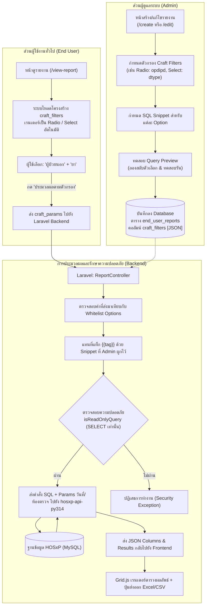

# แผนการพัฒนาระบบ Craft Query (Dynamic SQL Builder)
**สำหรับระบบจัดการรายงาน End-User Reports (hosinfo-v2)**

---

## 1. บทนำและวัตถุประสงค์ (Executive Summary & Objective)

### 1.1 ที่มาและความสำคัญ
ในระบบจัดการรายงานปัจจุบัน (`/end-user-reports`) รองรับการส่งพารามิเตอร์แบบ Prepared Parameters (เช่น `:start_date`, `:end_date`, `:department`, `:spclty`) ซึ่งเหมาะสำหรับการผูกค่าข้อมูล (Scalar values) ในเงื่อนไข `WHERE col = :param` 

อย่างไรก็ตาม ในการทำงานจริงของโรงพยาบาล (ระบบ HOSxP) มีรายงานจำนวนมากที่ต้องการ **"ปรับเปลี่ยนโครงสร้างของ Query ตามตัวเลือกที่ผู้ใช้เลือก (Craft Query)"** เช่น:
1. **การสลับประเภทผู้ป่วย (OPD / IPD / ทั้งหมด):** ซึ่งใน SQL ต้องเพิ่มเงื่อนไข `AND (an IS NULL OR an = '')` หรือ `AND (an IS NOT NULL OR an <> '')` หรือไม่ใส่เงื่อนไขเลย
2. **การสลับประเภทข้อมูล (ยา vs เวชภัณฑ์มิใช่ยา):** ซึ่งต้องเปลี่ยนรายชื่อคอลัมน์ใน `SELECT`, เปลี่ยนชื่อตารางใน `FROM` (`drugitems` vs `nondrugitems`), และเปลี่ยนเงื่อนไข `WHERE` หรือเปลี่ยน Subquery ทั้งก้อน

Prepared Statement ธรรมดาไม่สามารถทำสิ่งเหล่านี้ได้ ระบบจึงต้องมี **"Craft Query Engine"** ที่ช่วยให้ Admin สร้างตัวเลือกแบบ Dropdown หรือ Radio button แล้วระบบจะนำ SQL Snippet ที่ผูกไว้ไปประกอบ (Craft) คำสั่ง SQL ให้ถูกต้องและปลอดภัยโดยอัตโนมัติ

---

## 2. แผนผังสถาปัตยกรรมและการไหลของข้อมูล (Architecture & Data Flow)



---

## 3. การออกแบบฐานข้อมูล (Database Schema)

### 3.1 Migration
เพิ่มคอลัมน์ `craft_filters` ชนิด `JSON` (nullable) ในตาราง `end_user_reports`

```php
// database/migrations/2026_10_05_000001_add_craft_filters_to_end_user_reports_table.php
use Illuminate\Database\Migrations\Migration;
use Illuminate\Database\Schema\Blueprint;
use Illuminate\Support\Facades\Schema;

return new class extends Migration {
    public function up(): void
    {
        Schema::table('end_user_reports', function (Blueprint $table) {
            if (!Schema::hasColumn('end_user_reports', 'craft_filters')) {
                $table->json('craft_filters')->nullable()->after('has_spclty')
                      ->comment('โครงสร้างตัวกรองปรับแต่ง SQL เช่น radio, select และ sql snippets');
            }
        });
    }

    public function down(): void
    {
        Schema::table('end_user_reports', function (Blueprint $table) {
            $table->dropColumn('craft_filters');
        });
    }
};
```

### 3.2 Model Casting (`app/Models/EndUserReport.php`)
```php
protected $casts = [
    'craft_filters' => 'array',
    'is_active' => 'integer',
    'has_date_range' => 'integer',
    'has_department' => 'integer',
    'has_spclty' => 'integer',
];
```

### 3.3 โครงสร้างข้อมูล JSON (`craft_filters`)
```json
[
  {
    "id": "filter_opdipd_1",
    "name": "opdipd",
    "label": "ประเภทผู้ป่วย",
    "type": "radio",
    "default_value": "0",
    "options": [
      {
        "label": "ผู้ป่วยนอก (OPD)",
        "value": "1",
        "sql": "AND (an IS NULL OR an = '')"
      },
      {
        "label": "ผู้ป่วยใน (IPD)",
        "value": "2",
        "sql": "AND (an IS NOT NULL OR an <> '')"
      },
      {
        "label": "ทั้งหมด",
        "value": "0",
        "sql": ""
      }
    ]
  },
  {
    "id": "filter_dtype_2",
    "name": "dtype_select",
    "label": "ประเภทรายการ",
    "type": "select",
    "default_value": "drug",
    "options": [
      {
        "label": "ยา",
        "value": "drug",
        "sql": "SELECT d.icode, d.name, d.generic_name, d.dosageform, d.strength, d.units, IF(d.unitcost IS NOT NULL, d.unitcost, 0) AS unitcost, d.unitprice FROM drugitems d WHERE istatus = 'Y'"
      },
      {
        "label": "เวชภัณฑ์มิใช่ยา",
        "value": "nondrug",
        "sql": "SELECT d.icode, d.name, '' AS generic_name, '' AS dosageform, '' AS strength, d.unit AS units, IF(d.unitcost IS NOT NULL, d.unitcost, 0) AS unitcost, d.price AS unitprice FROM nondrugitems d WHERE istatus = 'Y' AND income = '04'"
      }
    ]
  }
]
```

---

## 4. การจัดการฝั่ง Backend และการรักษาความปลอดภัย (Backend & Security)

### 4.1 ความปลอดภัยระดับสูงสุด (SQL Injection Prevention)
* **Zero Direct Injection:** ผู้ใช้งานทั่วไป (End User) จะส่งมาเพียงรหัสตัวเลือก เช่น `opdipd = "1"` หรือ `dtype = "drug"` เท่านั้น **ไม่สามารถส่งข้อความ SQL ดิบขึ้นมาได้**
* **Whitelist-Only Replacement:** Controller จะค้นหา SQL Snippet จากข้อมูลการตั้งค่าของ Admin ที่เก็บใน Database เท่านั้น หากส่งค่าที่ไม่ตรงกับ Option ในระบบ จะถูกแทนที่ด้วยค่า Default ทันที
* **Read-Only Enforce:** หลังการ Craft Query เรียบร้อยแล้ว คำสั่งสุดท้ายจะผ่าน `$this->isReadOnlyQuery($sql)` ซึ่งตรวจสอบว่าขึ้นต้นด้วย `SELECT` / `WITH` และไม่มีคำสั่งต้องห้าม เช่น `DROP`, `DELETE`, `UPDATE`, `INSERT`, `ALTER`, `TRUNCATE`

### 4.2 กลไกการ Craft คำสั่ง SQL ใน `ReportController.php`
```php
/**
 * ประกอบคำสั่ง SQL จากโครงสร้าง Craft Filters และค่าที่ผู้ใช้เลือก
 */
private function craftSqlQuery(string $rawSql, ?array $craftFilters, array $userSelections): string
{
    if (empty($craftFilters) || !is_array($craftFilters)) {
        return $rawSql;
    }

    $craftedSql = $rawSql;

    foreach ($craftFilters as $filter) {
        $varName = trim($filter['name'] ?? '');
        if (empty($varName)) {
            continue;
        }

        // ดึงค่าที่ผู้ใช้ส่งมา หรือใช้ default_value
        $selectedValue = $userSelections[$varName] ?? ($filter['default_value'] ?? '');

        // ค้นหา option ที่ตรงกับค่าที่เลือก
        $matchedOption = null;
        if (!empty($filter['options']) && is_array($filter['options'])) {
            foreach ($filter['options'] as $opt) {
                if ((string)$opt['value'] === (string)$selectedValue) {
                    $matchedOption = $opt;
                    break;
                }
            }
            // หากไม่พบ ให้ fallback ไปที่ option แรก
            if (!$matchedOption && count($filter['options']) > 0) {
                $matchedOption = $filter['options'][0];
            }
        }

        $snippet = $matchedOption['sql'] ?? '';

        // แทนที่แท็กรูปแบบ {{varName}} และ {varName} ในคำสั่ง SQL
        $searchTags = [
            '{{' . $varName . '}}',
            '{' . $varName . '}',
        ];
        $craftedSql = str_replace($searchTags, $snippet, $craftedSql);
    }

    return $craftedSql;
}
```

### 4.3 ปรับปรุงฟังก์ชัน `executeReport` และ `testQuery`
* รับพารามิเตอร์ `craft_params` จาก Request
* เรียกใช้ `$craftedSql = $this->craftSqlQuery($sql, $craftFilters, $craftParams)`
* ตรวจสอบ `$this->isReadOnlyQuery($craftedSql)`
* ส่งคำสั่ง `$craftedSql` ไปยัง Python Backend API (`/api/v1/report/execute`)

---

## 5. การออกแบบหน้าจอฝั่ง Admin (`/create` & `/edit`)

### 5.1 ส่วนประกอบ UI ใหม่: "ตัวกรองปรับแต่ง SQL (Craft Query Filters)"
1. **แผงจัดการตัวกรอง (Craft Filter Builder Card):**
   * แสดงรายการตัวกรองที่มีอยู่ พร้อมปุ่มแก้ไข/ลบ
   * ปุ่ม **"+ เพิ่มตัวเลือกปรับแต่ง (Craft Option)"**
   * ปุ่ม **"ใช้แม่แบบสำเร็จรูป"** เช่น:
     * 🔹 แม่แบบประเภทผู้ป่วย (OPD / IPD / ทั้งหมด)
     * 🔹 แม่แบบสถานะการจำหน่าย (Discharged / Non-Discharged)
     * 🔹 แม่แบบช่วงอายุ (เด็ก / ผู้ใหญ่ / ผู้สูงอายุ)
2. **ฟอร์มระบุรายละเอียดตัวกรอง:**
   * **ชื่อตัวแปร (Variable):** เช่น `opdipd` (ระบบจะแจ้งแท็กที่ต้องใช้คือ `{{opdipd}}`)
   * **ป้ายชื่อ (Display Label):** เช่น "ประเภทผู้ป่วย"
   * **ประเภทการแสดงผล (Type):** Radio Button หรือ Select Dropdown
   * **ตารางตัวเลือก (Options Table):**
     * Label (ข้อความแสดงให้ user เห็น)
     * Value (รหัสอ้างอิง เช่น 1, 2, 0)
     * SQL Snippet (ชิ้นส่วนคำสั่ง SQL ที่จะนำไปแทนที่)
     * Default Checkbox (กำหนดเป็นตัวเลือกเริ่มต้น)
3. **เครื่องมือช่วยเหลือใน SQL Editor:**
   * แถบปุ่มแท็ก (Variable Tags Badge) ด้านบน SQL Textarea: คลิกปุ่ม `[+ แทรก {{opdipd}}]` เพื่อวางแท็กลงในตำแหน่งเคอร์เซอร์ของ Query ทันที
4. **แผงทดสอบ Query Preview:**
   * เรนเดอร์ตัวเลือก Radio / Select ของ Craft Filters ที่ Admin สร้างขึ้นมาให้ลองกดคลิกเลือกจริง
   * เมื่อกดปุ่ม **"ทดสอบ Query & Preview"** จะส่งค่าที่เลือกไปรันและแสดงผลลัพธ์ 10 แถวแรกทันที ทำให้ Admin ตรวจสอบความถูกต้องได้โดยไม่ต้องออกจากหน้าแก้ไข

---

## 6. การออกแบบหน้าจอฝั่ง End-User (`/view-report`)

### 6.1 ส่วน Filter Bar ด้านบน
* จัดวางเป็น Card สไตล์ Modern ร่วมกับตัวกรองช่วงวันที่, ห้องตรวจ (`kskdepartment`), และสาขา (`spclty`)
* สำหรับแต่ละ Craft Filter:
  * **กรณีเป็น `radio`:** แสดงเป็น Radio Group สไตล์ Badge/Segmented Control ที่คลิกเลือกง่าย ชัดเจน
  * **กรณีเป็น `select`:** แสดงเป็น Select Dropdown ขนาดกะทัดรัด พร้อม Label กำกับชัดเจน
* ค่าเริ่มต้นจะถูกเลือกตาม `default_value` ที่ Admin ตั้งค่าไว้

### 6.2 การทำงานเมื่อผู้ใช้เปลี่ยนตัวเลือก
1. ผู้ใช้คลิกเปลี่ยน Radio หรือ Dropdown
2. สถานะใน `craftParams` จะอัปเดตทันที
3. เมื่อผู้ใช้คลิกปุ่ม **"ประมวลผลตามตัวกรอง (Process)"**:
   * แสดงสถานะ Loading (Spinner)
   * ส่งค่าไปยัง Backend
   * Grid.js จะรีเฟรชตารางและอัปเดตคอลัมน์ใหม่อัตโนมัติ (Dynamic Columns)
4. การส่งออกไฟล์ **Excel (.xlsx)** และ **CSV**:
   * ส่งออกตามข้อมูลจริงที่ประมวลผลออกมาได้ทันที รวมทั้งคอลัมน์ที่เปลี่ยนไปตามตัวเลือก

---

## 7. ตัวอย่างการนำไปใช้งานจริง (ตามโค้ดตัวอย่างของผู้ใช้)

### 7.1 ตัวอย่างที่ 1: การสลับผู้ป่วยนอก / ผู้ป่วยใน (`opdipd`)

* **การตั้งค่าของ Admin ในระบบ:**
  * **Variable Name:** `opdipd`
  * **Label:** `ประเภทผู้ป่วย`
  * **Type:** `radio`
  * **Options:**
    1. Label: `ผู้ป่วยนอก` | Value: `1` | SQL: `AND (an IS NULL OR an = '')`
    2. Label: `ผู้ป่วยใน` | Value: `2` | SQL: `AND (an IS NOT NULL OR an <> '')`
    3. Label: `ทั้งหมด` | Value: `0` | SQL: ` ` *(ค่าว่าง)* | Default: `true`

* **คำสั่ง SQL ในระบบ:**
```sql
SELECT 
    icode, 
    COUNT(DISTINCT vn) AS vn_count, 
    COUNT(DISTINCT order_no) AS order_count, 
    SUM(IF(qty IS NOT NULL, qty, 0)) AS sum_qty,
    SUM(sum_price) AS sum_price 
FROM opitemrece 
WHERE rxdate BETWEEN :start_date AND :end_date 
  {{opdipd}} 
  AND dep_code = '085' 
  AND icode LIKE '1%'
GROUP BY icode
```

---

### 7.2 ตัวอย่างที่ 2: การสลับข้อมูล ยา vs เวชภัณฑ์มิใช่ยา (`dtype`)

* **การตั้งค่าของ Admin ในระบบ:**
  * **Variable Name:** `dtype_subquery`
  * **Label:** `ประเภทเวชภัณฑ์`
  * **Type:** `select`
  * **Options:**
    1. Label: `ยา` | Value: `drug` | Default: `true`
       * **SQL:**
         ```sql
         SELECT d.icode, d.name, d.generic_name, d.dosageform, d.strength, d.units, 
                IF(d.unitcost IS NOT NULL, d.unitcost, 0) AS unitcost, d.unitprice 
         FROM drugitems d 
         WHERE istatus = 'Y'
         ```
    2. Label: `เวชภัณฑ์มิใช่ยา` | Value: `nondrug`
       * **SQL:**
         ```sql
         SELECT d.icode, d.name, '' AS generic_name, '' AS dosageform, '' AS strength, d.unit AS units, 
                IF(d.unitcost IS NOT NULL, d.unitcost, 0) AS unitcost, d.price AS unitprice 
         FROM nondrugitems d 
         WHERE istatus = 'Y' AND income = '04'
         ```

* **คำสั่ง SQL เต็มในระบบ:**
```sql
SELECT 
    a.icode, 
    a.name, 
    a.generic_name, 
    a.dosageform, 
    a.strength, 
    a.units, 
    a.unitcost, 
    a.unitprice,
    b.vn_count, 
    b.order_count, 
    b.sum_qty, 
    b.sum_price, 
    a.unitcost * b.sum_qty AS sum_cost 
FROM (
    SELECT 
        icode, 
        COUNT(DISTINCT vn) AS vn_count, 
        COUNT(DISTINCT order_no) AS order_count, 
        SUM(IF(qty IS NOT NULL, qty, 0)) AS sum_qty,
        SUM(sum_price) AS sum_price 
    FROM opitemrece 
    WHERE rxdate BETWEEN :start_date AND :end_date 
      {{opdipd}} 
      AND dep_code = '085' 
      AND icode LIKE '1%'
    GROUP BY icode
) b
LEFT JOIN (
    {{dtype_subquery}}
) a ON a.icode = b.icode
```

---

## 8. ขั้นตอนการดำเนินงานทีละเฟส (Implementation Roadmap)

| เฟส | กิจกรรมหลัก | ไฟล์ที่แก้ไข/สร้างใหม่ |
|:---|:---|:---|
| **Phase 1** | **Database & Model**<br>- สร้าง Migration เพิ่มคอลัมน์ `craft_filters`<br>- รัน `php artisan migrate`<br>- อัปเดต Model `EndUserReport` เพิ่ม `$casts` | `database/migrations/*_add_craft_filters_...php`<br>`app/Models/EndUserReport.php` |
| **Phase 2** | **Backend Controller & Engine**<br>- เพิ่มฟังก์ชัน `craftSqlQuery(...)`<br>- อัปเดต `store` และ `update` ให้บันทึก `craft_filters`<br>- อัปเดต `executeReport` ให้รับ `craft_params` และ Craft SQL ก่อนส่งไป Python API<br>- อัปเดต `testQuery` ให้รองรับการทดสอบ Craft Query | `app/Http/Controllers/ReportController.php` |
| **Phase 3** | **Admin UI: Create Report**<br>- เพิ่ม Component จัดการ Craft Filters (Radio / Select, Options, Snippet)<br>- เพิ่มปุ่มแทรก Tag `{{variable}}` ลงใน SQL textarea<br>- เพิ่ม Interactive Controls ในกล่องทดสอบ Preview | `resources/js/pages/reports/create-report/index.tsx` |
| **Phase 4** | **Admin UI: Edit Report**<br>- เชื่อมต่อข้อมูล `craft_filters` เดิมเข้าสู่ฟอร์มแก้ไข<br>- รองรับการเพิ่ม/แก้ไข/ลบตัวเลือกและทดสอบ Preview | `resources/js/pages/reports/edit-report/index.tsx` |
| **Phase 5** | **End-User UI: View Report & Testing**<br>- เรนเดอร์ Radio / Select ใน Filter Bar หน้าดูรายงาน<br>- ผูก State `craftParams` และส่งไปที่ `/execute`<br>- ทดสอบการรันรายงานจริงทั้ง 2 ตัวอย่าง (OPD/IPD และ Drug/Non-drug)<br>- ตรวจสอบผลการส่งออกไฟล์ Excel และ CSV | `resources/js/pages/reports/view-report/index.tsx` |

---

## 9. ตรวจสอบความพร้อมและสิ่งที่ต้องระวัง (Risk Assessment & Checklist)

1. **การใช้งานร่วมกับตัวกรองเดิม:**
   * ตรวจสอบให้แน่ใจว่าตัวกรองเดิม (`:start_date`, `:end_date`, `:department`, `:spclty`) ยังคงทำงานร่วมกับ Craft Query ได้อย่างราบรื่น
2. **การตั้งชื่อตัวแปร (Variable Naming):**
   * ควรจำกัดให้ใช้ตัวอักษรภาษาอังกฤษ ตัวเลข และ underscore (เช่น `opdipd`, `dtype_subquery`) เพื่อป้องกันข้อผิดพลาดในการ parse ข้อความ
3. **การทดสอบความเร็วและ Performance:**
   * เนื่องจาก Python Backend เชื่อมต่อกับ MySQL HOSxP โดยตรง คำสั่ง SQL ที่ Craft ออกมาต้องเป็นคำสั่งที่ผ่านการทดสอบ Index มาแล้วอย่างเหมาะสม
